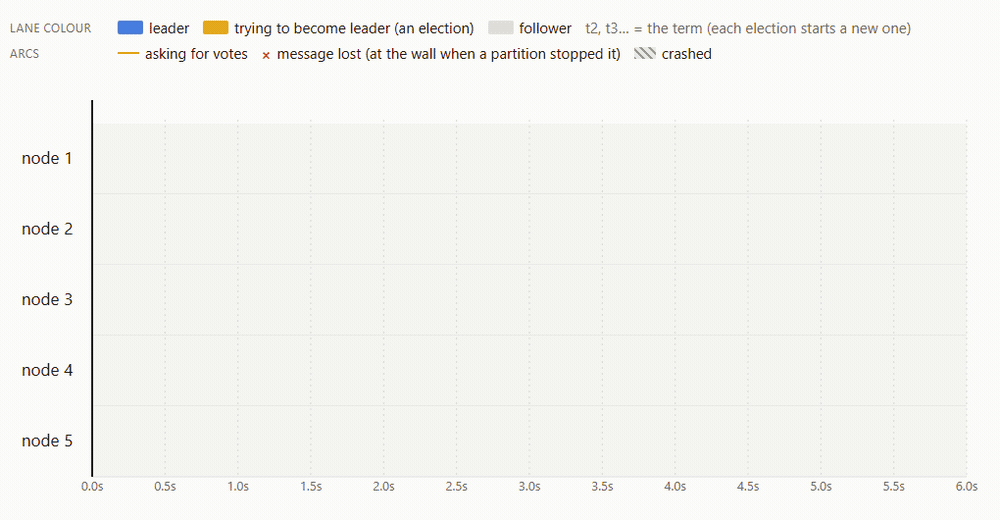

<p align="center">
  
</p>

# nemea

You just watched five Raft nodes lose their network for two seconds. The two on the wrong side of
the wall tried twelve times to elect a leader and never could — every vote request died at the
wall. The three on the right side kept theirs. When the wall came down, one election settled it,
and a node that crashed came back with its log intact.

That run is not a recording of luck. It is seed 19, and it replays byte for byte on your machine:

```
npx nemea demo
```

runs it, prints what happened, writes `nemea-demo.jsonl`, and opens it in the studio. Any trace
opens the same way: `npx nemea replay some-trace.jsonl`.

## What it is

nemea is deterministic simulation testing for distributed systems, in TypeScript. You write a
protocol against a small interface, run it under a deterministic scheduler with injected faults —
latency, loss, duplication, partitions, crashes — and when an invariant breaks you get a seed that
reproduces the failure exactly, and a trace you can scrub through.

The engine is small and has no dependencies. Raft ships as the proof that the interface is enough:
a transcription of the paper, with each of the ten classically mis-implemented rules tested
against its naive form, including the Figure 8 sequence.

## Write a protocol

```ts
import { simulate, type Ctx, type Process } from '@nemea/core';

interface State { count: number; [k: string]: unknown }

class Ping implements Process<State> {
  init(ctx: Ctx<State>): State {
    ctx.setTimer('tick', 10 + Math.floor(ctx.random() * 20)); // time and randomness come from ctx, never ambient
    return { count: 0 };
  }
  onTimer(ctx: Ctx<State>): void {
    ctx.state.count++;
    ctx.send(ctx.peers[0]!, { type: 'ping', n: ctx.state.count });
    ctx.setTimer('tick', 30);
  }
  onMessage(ctx: Ctx<State>): void {
    ctx.state.count++;
  }
}

const result = simulate<State>({
  seed: 0xc0ffee,
  nodes: 3,
  process: Ping,
  until: { simTime: 5_000 },
  network: { latency: [10, 50], dropRate: 0.02, partitions: [{ groups: [[1], [2, 3]], start: 1000, end: 2000 }] },
  faults: { crashes: [{ node: 2, at: 2500, restartAt: 3000 }] },
  invariants: [{ name: 'countNeverNegative', check: (w) => (w.nodes.some((n) => n.state !== null && n.state.count < 0) ? 'negative' : null) }],
});

result.violation; // null, or { invariant, detail, step, time } — and the seed above reproduces it
result.jsonl;     // the trace: `npx nemea replay` opens it
```

A process sees the world only through `ctx`. There is no other way to get the time, a random
number, or a timer, and a lint rule keeps it that way.

## Determinism, enforced

Same seed, same trace, byte for byte — across runs, machines and Node versions. CI hashes the
example traces on Node 20, 22 and 24 on every push; an engine change that alters a single byte
fails the build. When a fuzz run finds a violation, the seed is the whole bug report.

## What's here

- [`packages/core`](packages/core) — the engine: clock, event queue, PRNG, network model, faults, invariants, trace.
- [`packages/protocols`](packages/protocols) — Raft, transcribed from the paper; see [`docs/RAFT.md`](docs/RAFT.md).
- [`apps/studio`](apps/studio) — the replay viewer, a pure function of the trace file.
- [`examples`](examples) — the two fixed scenarios, with their trace hashes pinned in CI.
- [`docs/SPEC.md`](docs/SPEC.md) — what v0 is, precisely. [`docs/DECISIONS.md`](docs/DECISIONS.md) — why.

v0. Apache-2.0.
